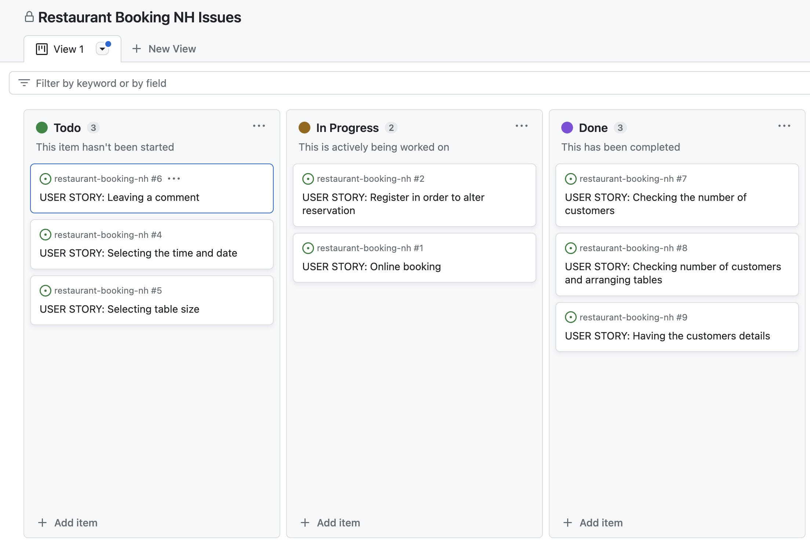

# Restaurant Booking NH
## Introduction
This website is designed for a fictional bakery restaurant. Through Restaurant Booking NH users are able to create an account, login, make reservations and then manage them for the bakery restaurant. 

This website has been created as the Fourth Milestone project for Code Institute's Full Stack Software Development Diploma and was built using Full Stack Toolkit. The project is using Django, Python, HTML and CSS as main technologies. 

[Live Version]()

## Site Goals:
* Allow users to create an account 
* Allow users to make a reservation at the restaurant
* Allow users to edit or cancel their booking
* Allow the restaurant owner to collect a database of customers who have booked with them

# Table of contents:
1. [UX](#ux)
  * [User Stories](#user-stories) 
  * [Development Planes](#development-planes)
    * [Strategy](#strategy)
    * [Scope](#scope)
    * [Structure](#structure)
    * [Wireframes](#wireframes)
    * [Surface](#surface)
2. [Features](#features)
3. [Technologies](#technologies)
4. [Testing](Testing)
5. [Deployment](#deployment)

# UX
## User Stories 
This project was developed with agile planning. This means that each individual feature was split first into User Stories for what the user of the website would expect. GitHub issues were used to record all the user stories. As the project progressed each story was then moved from 'To Do' to 'In Progress' to 'Done'.

* As a customer you will:
  * Be able to create an account.
  * Be able to select the time and date of reservation.
  * Be able to select the group size and leave a comment in case they have any special requirements.
  * Be able to edit their reservation or delete it.

* As a site administrator you will:
  * Be able to check the number of costumers.
  * Be able to see details of the customers.

## Development Planes
### Strategy
#### Targeted Users
* A user that wants to reserve a table in the bakery restaurant, who could be an old or a new user of any age group that prefer to use an online booking system. 

#### Site Goals
* For users to be able to create an account.
* For users to be able to reserve a table.
* For users to be able to edit or delete their reservation online.

#### Project Goals 
* Create a booking website for a bakery that will help facilitate their services and reduce the human workload by having an easy to use booking system which they can access easily. This will bring them a quick way of checking the number of costumers and also they will be able to keep their customers information. 
* Learn how to create a booking system which has full CRUD functionality.

### Scope 
The Scope Plane was about developing website requirements based on the goals set out in the strategy plane.
* Home page welcome message which immediately tells the user what the site is for.
* Account registration which will allow for restricted viewing on Editing and Deleting pages and booking an reservation..
* Fully responsive website, tested across all screen sizes, with navigation for mobile.
* Ability to create, view, update and delete appointments.

### Structure
The information above has been used then to create the structure of the site. The diagram has been generated by following these steps created with Lucidchard app.

### Wireframes 
Before building, when planning this website I used the design tool Balsamiq, to create a wireframe of the project. It allowed me to make a basic sketch of what I wanted the the website to look like, what features to include and where to place them. This proved to be very useful as I could base my decisions on the already sketched out wireframe when building the website.

#### Surface
#### Style and colors
The style I was aiming for in the end would be a elegant and warm impression and I wanted it to be a theme throughout the entire website. 

Colours have been specified in CSS by hexadecimal (or hex) values. The colours used are complementary colours.

The navigation bar is cold green and the content is mostly pink. Tha footer is lila which fits well with the rest of colors.

Green is meant to make the user think about fresh products and nature, then pink and gold to introduce him to the world of fairytales as if to say that despite being made with natural ingredients the products also look very good.

Font styles used is Castoro Titling from Google Fonts. 

# Features
## Existing Features
  1. Home Page 
  
  On the landing page the user is welcomed and assured about what the site is about through a main message. Also navbar and footer are present from where he can explore further.

  2. Navigation
  
  At the top of every view, the user is presented with a navbar. The navbar contains the restaurants logo, which by clicking, allows user to return to the front page at any time. Also to the right the navbar consists of links to a Book A Table page, a Register page, a Login page and for authorised users a Reservations, as well as a Home button that brings the user back to the landing page. 
  On smaller screens all the above features collapse under a hamburger menu, except from the logo which always stays on the left of navigation bar.

  3.  Book a Table 
  
  Next up is the Book A Table page. Which has all the previously mentioned header and footer features and a reservation form.
  Once a user has either logged into their account or created an account they will be able to view the reservation form
  On the reservation form, after filling their details, the user has the option to pick the date, time and groupsize for the reservation.
  The user also has the option to leave a comment through which the user can let the restaurant know of any special requirements.

  4. Register
  
  On the register page user will have to fill their details, register and then login, in order to be able to make a reservation. 
 
  5. Reservations
  
  Once logged in user can go into the Reservations area from where he can see, edit or cancel his reservations. 

  6. Footer 
  
  The footer section is present on all pages and it includes links to all social media pages. It is useful for the user as it encourages them to keep connected through social media and it also helps the bakery, as it increases publicity.
  

## Features Left to Implement
  * Automated confirmation emails - emails to be sent out to a user when they have made, edited or cancelled a booking
  * Avoid overbookings - a backend feature that filters through all the bookings at a certain time and makes sure that the number of bookings does not exceed the number of available seats

## Technologies
For this project, the following technologies were used.  

### Languages:
* HTML
* CSS
* Python
* Javascript
 
### Frameworks, Libraries, Programs & Applications Used:
* Django
* PostgreSQL
* Bootstrap

#### Google Font
* Google Font was used to import the chosen font for this project Lora.

#### Font Awesome
* Font Awesome was used on each page of the website to provide icons for UX purposes.  

#### GitPod
* GitPod was used for writing all the code for this project. It was also used to commit and push to GitHub.  

#### GitHub 
* GitHub was used to store this project.

#### Heroku
* Heroku was used to deploy the project.

#### Cloudinary
* Cloudinary was used to store some of the images used in this project

#### Balsamiq 
* Balsamiq was used to draw initial Wireframes for this project.

#### Lucidchart
* Lucidchart was used during the structure phase of this project. It was used to create a sitemap of the website. 

#### Google Development Tools
* Google Dev Tools was used to edit code and check responsiveness before making the changes permanent.

## Testing 
### Responsiveness
Nicoles Sweet Home project looks and works on different browsers and screen sizes. Manual testing was conducted for responsiveness on small, medium and large screens. Elements in all pages respond as inteded on all devices.

### Validation
I have used the pycodestyle library to help me find and solve the errors in my code. 

### Fixed Bugs 
* 

# Deployment

The following are the steps I went through to deploy my live site:

- The site was deployed using Heroku. The steps to deploy are as follows: 
1. Go to [Heroku](https://dashboard.heroku.com/apps)
2. Go to 'New' and select 'Create a new app'
3. Input your app name and create app.
4. Navigate to 'Settings'
5. On the Config Vars section, enter the following values:
    - SECRET_KEY: The Secret Key for your project
    - DATABASE_URL: The URL from your ElephantSQL dashboard
    - CLOUNDINARY_URL: The URL from your Cloudinary dashboard
    - PORT: 8000
6. Navigate to the 'Deploy' section. 
7. Connect to GitHub, search for your repo and confirm. 
8. Choose branch to deploy.
9. Your app should now be available to see. You can choose whether to have your app automatically redeploy with every push or to keep it manual. 

- To Fork the repository:
  - On GitHub.com, navigate to the repository.
  - In the top-right corner of the page, click Fork.
  - Select an owner for the forked repository.
  - By default, forks are named the same as their parent repositories. You can change the name of the fork to distinguish it further.
  - Optionally, add a description of your fork.
  - Choose whether to copy only the default branch or all branches to the new fork.
  - Click Create fork.

- To Clone the repository:
  - On GitHub.com, navigate to the repository.
  - Above the list of files, click the Code button.
  - Copy the URL for the repository.
  - Open Git Bash.
  - Change the current working directory to the location where you want the cloned directory.
  - Type git clone, and then paste the URL you copied earlier.
  - Press Enter. Your local clone will be created.

### Gitpod
After opening the repository in GitHub, you can press on Gitpod button which will take you to Gitpod. 
In Gitpod first termcolor needs to be installed by typing `python3 -m pip install termcolor`, then app is run by pressing `python3 run.py` command on terminal.

## Media Credits 

Diagram has been created using: 
[Lucidchard](https://www.lucidchart.com/pages/)

Python code has been written with inspiration from:
* [Code Institute](https://codeinstitute.net/)

As I have been using the idea provided in Portofolio Project 3 Scope. 

And with extra support from:
* [Code Institute](https://codeinstitute.net/)
* [Slack](https://slack.com/intl/en-gb)
* [W3schools](https://www.w3schools.com/js/)
