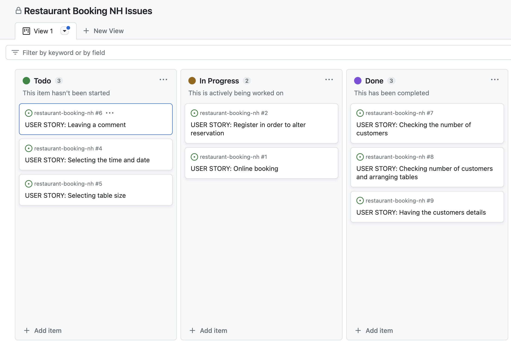

# Restaurant Booking NH
## Introduction
This website is designed for a fictional bakery restaurant. Through Restaurant Booking NH users are able to create an account, login, make reservations and then manage them for the bakery restaurant. 

This website has been created as the Fourth Milestone project for Code Institute's Full Stack Software Development Diploma and was built using Full Stack Toolkit. The project is using Django, Python, HTML and CSS as main technologies. 

[Live Version]()

## Site Goals:
* Allow users to create an account 
* Allow users to make a reservation at the restaurant
* Allow users to edit or cancel their booking
* Allow the restaurant owner to collect a database of customers who have booked with them

## Table of contents:
1. UX
  * User Stories 
  * Development Planes 
    * Strategy
    * Scope
    * Structure
    * Skeleton
    * Surface
2. 
3. 
4. 

## UX
### User Stories 
This project was developed with agile planning. This means that each individual feature was split first into User Stories for what the user of the website would expect. GitHub issues were used to record all the user stories. As the project progressed each story was then moved from 'To Do' to 'In Progress' to 'Done'.

* As a customer you will:
  * Be able to create an account.
  * Be able to select the time and date of reservation.
  * Be able to select the group size and leave a comment in case they have any special requirements.
  * Be able to edit their reservation or delete it.

* As a site administrator you will:
  * Be able to check the number of costumers.
  * Be able to see details of the customers.

### Development Planes
#### Strategy
##### Targeted Users
* A user that wants to reserve a table in the bakery restaurant, who could be an old or a new user of any age group that prefer to use an online booking system. 

##### Site Goals
* For users to be able to create an account.
* For users to be able to reserve a table.
* For users to be able to edit or delete their reservation online.

##### Project Goals 
* Create a booking website for a bakery that will help facilitate their services and reduce the human workload by having an easy to use booking system which they can access easily. This will bring them a quick way of checking the number of costumers and also they will be able to keep their customers information. 
* Learn how to create a booking system which has full CRUD functionality.

#### Scope 
The Scope Plane was about developing website requirements based on the goals set out in the strategy plane.
* Home page welcome message which immediately tells the user what the site is for.
* Account registration which will allow for restricted viewing on Editing and Deleting pages and booking an reservation..
* Fully responsive website, tested across all screen sizes, with navigation for mobile.
* Ability to create, view, update and delete appointments.

#### Structure
The information above was then used to create a structure for the website. Below is a site map showing how users can navigate the website intuitively.

### Existing Features
  1. 
  2. 
  3. 
  4. 
  5. 
  6. 
  7. 

  

  

### Features Left to Implement
  * 
  * 
  * 

## Code Structure 

## Technologies used 
* GitHub

The project repository has been created in Github.
* Gitpod

The code has been written in Gitpod.
* Heroku

Project has been deployed on Heroku. 
* Python

The app has been build using python program. 

## Testing 

### Validation
I have used the pycodestyle library to help me find and solve the errors in my code. 

### Fixed Bugs 
* 

## Deployment

### Heroku
The project is deployed on Heroku. The steps are as follow:

1. In your project: Create `requirements.txt` file with
 `pip3 freeze` > `requirements.txt`
2. Create Heroku account.
3. Create new project. 
4. Pick Github and find the repo with the project you want to deploy.
5. Go to Setting and press Reveal Config Vars.
4. You must then create a _Config Var_ called `PORT`. Set this to `8000`
5. Underneath add the following buildpacks:
      1. `heroku/python`
      2. `heroku/nodejs`
5. Go to Deploy button, pick which branch you want to deploy - was main in my case.
6. Click deploy and wait until the project is build, watch out for any errors.

### Gitpod
After opening the repository in GitHub, you can press on Gitpod button which will take you to Gitpod. 
In Gitpod first termcolor needs to be installed by typing `python3 -m pip install termcolor`, then app is run by pressing `python3 run.py` command on terminal.

## Media Credits 

Diagram has been created using: 
[Lucidchard](https://www.lucidchart.com/pages/)

Python code has been written with inspiration from:
* [Code Institute](https://codeinstitute.net/)

As I have been using the idea provided in Portofolio Project 3 Scope. 

And with extra support from:
* [Code Institute](https://codeinstitute.net/)
* [Slack](https://slack.com/intl/en-gb)
* [W3schools](https://www.w3schools.com/js/)
